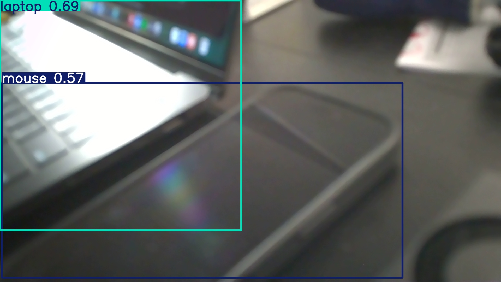

# The Build Log

Teaching a small computer to see.

---

## April 12, 2026 — First Light

There's a little computer on my desk. Eight gigs of RAM, a thousand CUDA cores, and an ARM chip the size of a postage stamp. I flashed it back in February and left it alone for six weeks.

Today I plugged it back in.

---

SSH in. Password. Blinking cursor. It's alive.

209 gigs of empty NVMe. CUDA installed but invisible — the compiler was there, the shell just didn't know where to look. Added it to PATH. One line in `.bashrc` and suddenly the machine knows what it's capable of.

There's something in that. You have the tools but you can't find them. One line fixes it.

---

PyTorch was a journey.

On a normal computer you `pip install torch` and go make coffee. On a Jetson you can't. ARM chip. The binaries that work on every other computer in the world? Useless here. You need NVIDIA's build, compiled specifically for this hardware, hosted on their own server.

The address is `pypi.jetson-ai-lab.io`. I tried `.dev` first. Doesn't exist. Tried `.com`. Also doesn't exist. `.io` does.

Two wrong URLs. Forty-five minutes. One right URL.

Then PyTorch imported and immediately crashed. Missing library: `libcudss.so.0`. A sparse solver library that JetPack doesn't ship but PyTorch 2.11 demands. Downloaded a tarball. Extracted it. Copied `.so` files by hand.

```
python3 -c "import torch; print(torch.cuda.is_available())"
True
```

An hour and a half of work. Four characters of output.

---

Tested YOLO on a stock photo. Bus on a street. Four persons, one bus, 203 milliseconds. All tensors on `cuda:0`.

The GPU was awake.

Built a streaming pipeline next. Server on the Jetson, client on the MacBook. Webcam captures a frame, compresses it to JPEG, shoots it over WiFi, Jetson runs YOLO, sends back a JSON of what it saw. TCP sockets. Length-prefixed messages. The dumbest possible protocol that actually works.

5.7 FPS. Slow. But it worked. My webcam was being interpreted by a computer across the room. Bounding boxes on objects it's never seen in my apartment.

Person. TV. Laptop.

---

Then I plugged in the camera.

ArduCam UC-873. IMX519 sensor. 16 megapixels through a CSI ribbon cable thinner than a shoelace.

`/dev/video0` appeared. System saw the hardware. Took a picture.

Green.

Not green like a forest. Green like a wall of pure emerald nothing. Every pixel.

The camera was outputting raw Bayer data — the sensor's native mosaic of red, green, and blue filters — and OpenCV was reading it like a finished image. It wasn't. It was ingredients, not a dish. If words are ingredients, then poetry isn't food, it's a dish. You can't just get to the punchline. You have to cook it.

Half the pixels on any camera sensor are green. That's the Bayer pattern. Two greens for every red and blue, because human eyes are most sensitive to green. When you read that raw data without processing it, you get a green screen. The camera was seeing fine. The software was illiterate.

---

Four green screens later I found the fix.

NVIDIA's ISP. Image Signal Processor. Dedicated silicon on the Jetson that does what your retina does — takes raw light and makes it mean something. Debayering. White balance. Exposure. The translation from photons to color.

`nvarguscamerasrc` — that's the GStreamer element that talks to the ISP. I threaded it into a pipeline: sensor → ISP → format converter → color converter → OpenCV. Each step transforms the data. Like a sentence translated through four languages before it arrives in one you understand.

But. The OpenCV I'd installed from pip didn't speak GStreamer. Wrong build. Generic. Had to throw it away, install the system OpenCV, then downgrade NumPy because the old OpenCV couldn't talk to the new NumPy.

Every layer in this stack was built by different people, at different times, for different assumptions about what hardware it would run on. Getting them to agree is the actual work.

---

Then it worked.

A lamp. Warm amber light against a ceiling. Out of focus. The ISP had just woken up. Autofocus hadn't settled. Exposure still adjusting. But the colors were real.

Photons traveled from a lightbulb through a lens onto a 16-megapixel sensor, got read as 10-bit Bayer, processed through dedicated silicon, converted through four format stages, and landed as a JPEG on an NVMe drive.

First properly seen image.

`first_light.jpg`.


Connected YOLO. Detections started streaming.

```
[FPS: 22.1] person (0.92)
[FPS: 23.4] person (0.92)
[FPS: 23.6] tv (0.87)
[FPS: 24.0] laptop (0.84)
[FPS: 24.8] laptop (0.69), mouse (0.57)
```

23.7 frames per second. Four times faster than the WiFi streaming. No network, no MacBook, no middleman. Just a camera and a GPU and 80 classes of objects it learned to recognize from a dataset it's never seen my apartment in.



It doesn't know what these things are. It knows what they look like. Different thing entirely.

I pointed it around the room. It tracked me when I moved. Found my laptop at 90% confidence. Saw the TV on the wall. Couldn't decide what my phone was. The model was trained on 80 common objects and not everything in my room maps neatly onto those categories.

But it was seeing. Blurry, imperfect, confident about some things and uncertain about others. Like anything that just opened its eyes.

---

### What's on the desk now

A Jetson Orin Nano with a CSI camera, running YOLO at 24 frames per second, detecting objects in real time with no internet, no cloud, no laptop. A self-contained eye.

It doesn't understand yet. It recognizes. Understanding comes later — tracking objects over time, learning that a person who leaves a room is the same person who entered it. Right now it sees each frame with no memory of the one before.

But the scaffolding is there. Camera works. ISP processes. GPU infers. Software connects.

Tomorrow I'll teach it to remember.

---

| What | Value |
|------|-------|
| Time from first SSH to first detection | ~3 hours |
| Wrong URLs tried for PyTorch | 2 |
| Missing libraries manually installed | 1 |
| Green screens before ISP worked | 4 |
| Final FPS | 23.7 |
| Objects it can recognize | 80 |
| Objects it will learn to recognize | TBD |
